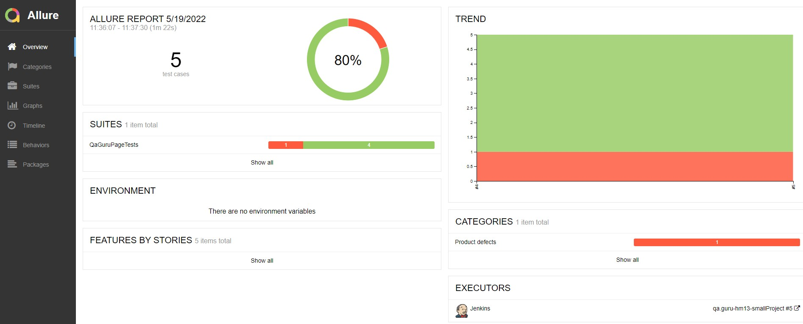
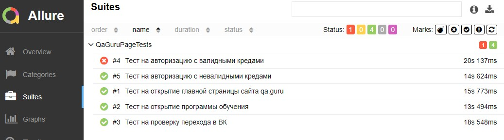
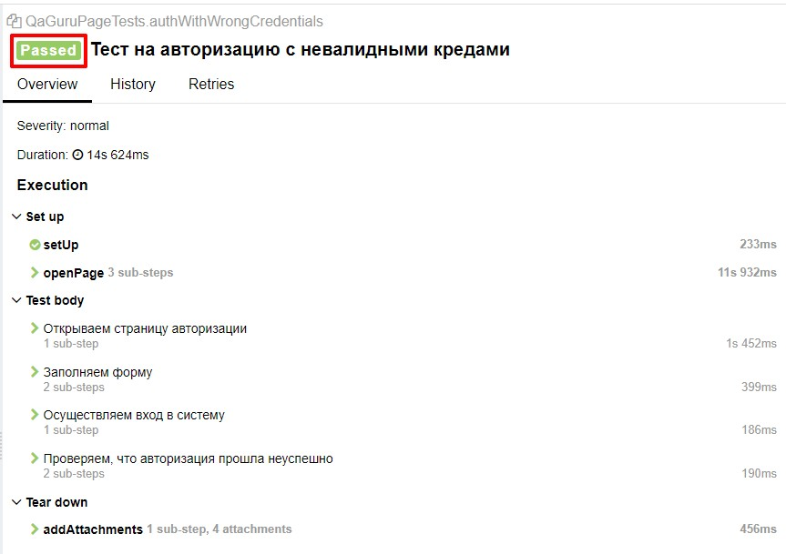
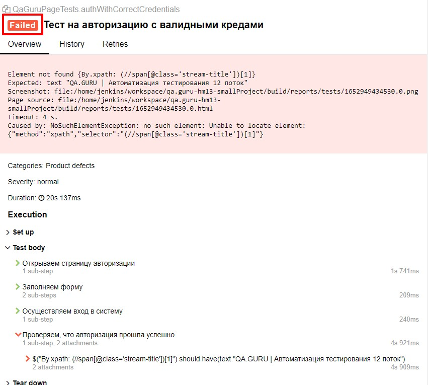
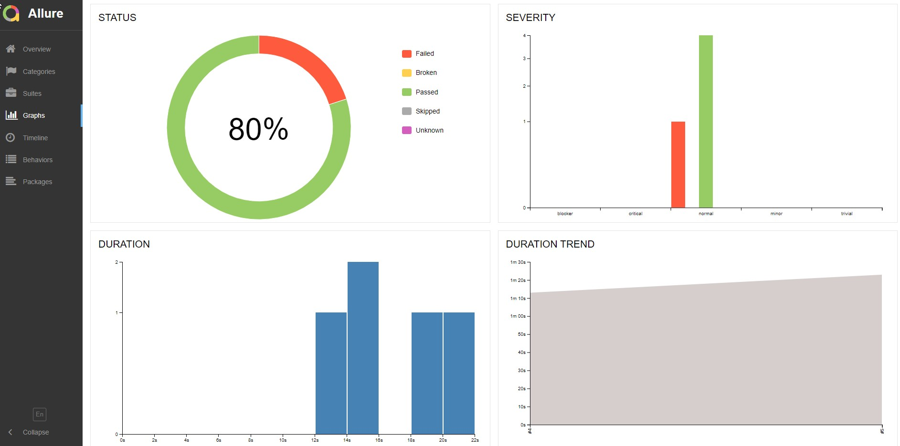
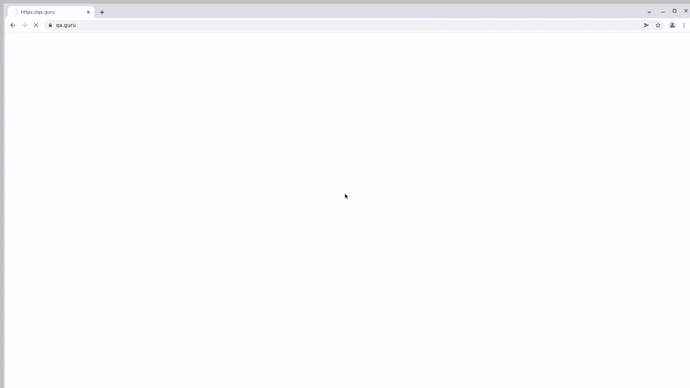
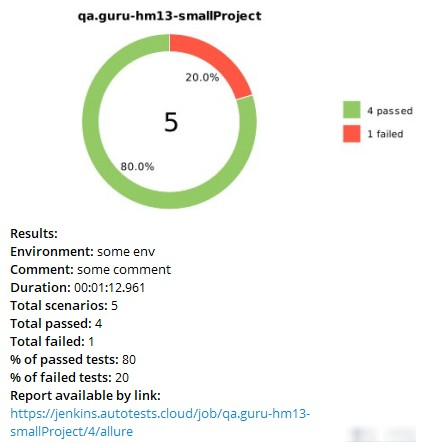

## Проект по автоматизации тестирования для сайта QA.GURU ☀️️

### <a target="_blank" href="https://qa.guru/">Перейти на сайт школы инженеров по автоматизации тестирования</a>

### 💎Содержание:

- <a href="#технологии-и-инструменты">Технологии и инструменты</a>
- <a href="#реализованные-проверки">Реализованные проверки</a>
- <a href="#сборка-в-jenkins">Сборка в Jenkins</a>
- <a href="#запуск-из-терминала">Запуск из терминала</a>
- <a href="#allure-отчет">Allure отчет</a>
- <a href="#видео-примеры-прохождения-тест-кейсов">Видео примеры прохождения тест-кейсов</a>
- <a href="#отчет-в-telegram">Отчет в Telegram</a>

### 💎[Технологии и инструменты](#технологии-и-инструменты)

### 💎[Реализованные проверки](#реализованные-проверки)
* Тест на открытие главной страницы сайта qa.guru.
* Тест на открытие программы обучения.
* Тест на проверку перехода в ВК.
* Тест на авторизацию с невалидными кредами.
* Тест на авторизацию с валидными кредами.

### 💎[Сборка в Jenkins](#сборка-в-jenkins)
#### <a target="_blank" href="https://jenkins.autotests.cloud/job/qa.guru-hm13-smallProject/">Перейти на сборку</a>

### 💎[Запуск из терминала](#запуск-из-терминала)
* #### Локальный запуск тест-кейсов
**gradle clean test**

* #### Удаленный запуск тест-кейсов
**clean test**  
-DpropertyBrowser=${PROPERTYBROWSER}  
-DpropertyVersion=${PROPERTYVERSION}  
-DpropertyBrowserSize=${PROPERTYBROWSERSIZE}, где  
**propertyBrowser** - браузер, по умолчанию Chrome;  
**propertyVersion** - версия браузера, по умолчанию 100;  
**propertyBrowserSize** - размер окна браузера, по умолчанию 1920x1080.

### 💎[Allure отчет](#allure-отчет)
#### Сводные данные

#### Тест-кейсы

##### Пример успешного прохождения тест-кейса

##### Пример неуспешного прохождения тест-кейса
Неуспешный тест-кейс добавлен в проект для наглядности. Для его успешного прохождения необходимо добавить переменные -  
(email адрес и пароль) в переменные окружения.

#### Графики

#### Выводы
Подключение Allure Report к проекту позволяет выявить в короткие сроки причины неуспешных тест-кейсов.
Статистика прохождения тест-кейсов представлена наглядно и доступно.

### 💎[Видео примеры прохождения тест-кейсов](#видео-примеры-прохождения-тест-кейсов)
К каждому тест-кейсу прилагается запись прохождения теста. Одно из таких видео представлено ниже.

### 💎[Отчет в Telegram](#отчет-в-telegram)
Для быстрого реагирования на результаты прохождения тест-кейсов, на проекте настроены быстрые уведомления в Telegram.  
Уведомления выглядит следующим образом:

❤️ <a target="_blank" href="https://qa.guru">qa.guru</a> 
💙 <a target="_blank" href="https://t.me/qa_guru_chat">t.me/qa_guru_chat</a>